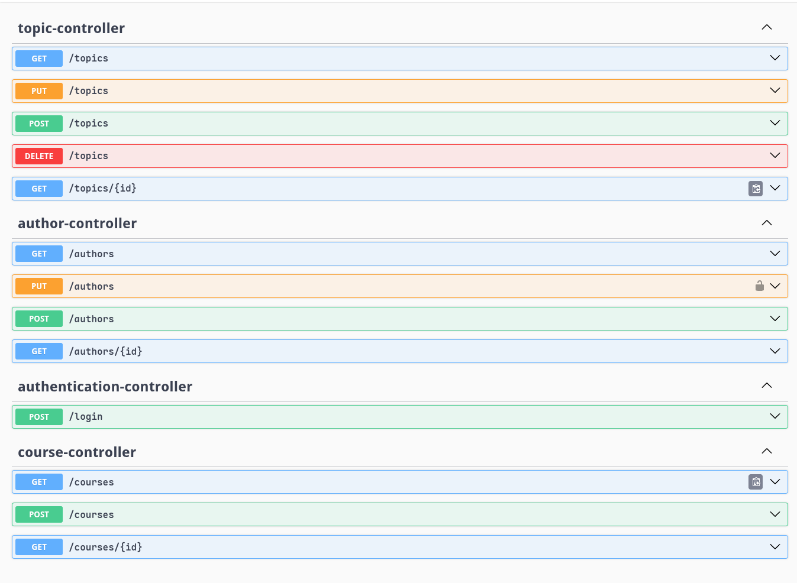

# forum-hub-challenge

## Descrição:
Este projeto é uma resposta ao desafio Back-end da [Alura](https://www.alura.com.br) em parceria com a [Oracle](https://www.oracle.com/br/education/oracle-next-education) para criação de uma API REST com endpoints que replicam as funcionalidades do fórum de um curso online.

## ✨ Funcionalidades:
- CRUD de usuários, cursos, tópicos.
- Implementação de segurança com Spring Security.
- Autenticação e autorização de usuários com JWT.
- Validação de dados com Bean Validation.
- Documentação da API com Swagger.
- Versionamento de banco de dados com Flyway.
- Configuração de variáveis de ambiente para facilitar a configuração do ambiente de desenvolvimento e produção.

## Requisitos:
- Java 21+
- MySQL 8.0+
- Docker (opcional)

## 📦 Instalação:

1 - Clone o repositório:
```bash
git clone https://github.com/leandrofmoraes/forum-hub-challenge.git && cd forum-hub-challenge
```

2 - Crie um banco de dados MySQL ou se tiver o Docker instalado, utilize o docker-compose para criar um container (Recomendado):

- Crie um arquivo `.env` na raiz do projeto com as seguintes variáveis:
```dotenv
MYSQL_USER=<seu_usuário>
MYSQL_PASSWORD=<senha>
MYSQL_DATABASE=forumhub
MYSQL_PORT=3306
```
- Execute o comando abaixo para iniciar o container MySQL:
```bash
docker-compose --env-file .env up -d
```

3 - Antes de rodar a aplicação, é necessário configurar as variáveis de ambiente:
```bash
MYSQL_USER=<seu_usuário>
MYSQL_PASSWORD=<senha>
MYSQL_DATABASE=<nome_do_banco> #(opcional, padrão: forumhub)
MYSQL_PORT=<porta_mysql> #(opcional, padrão: 3306)
JWT_SECRET=<seu_segredo_jwt>
```
- Se estiver em um ambiente Unix, você pode definir as variáveis de ambiente diretamente no terminal:
```bash
export $(grep -v '^#' .env)
export JWT_SECRET=<seu_segredo_jwt>
```

## Build
1 - Compilar o projeto:
```bash
./mvnw clean package
```
2 - execute o arquivo JAR gerado:
```bash
java -jar target/*.jar
```
3 - Ou, se preferir, você pode executar o projeto diretamente com o Maven:
```bash
./mvnw spring-boot:run
```

## Usando a API
Estes são os endpoints disponíveis:


- Exemplos de requisição protegida com JWT:
```bash
curl -H "Authorization: Bearer $JWT_SECRET" \
     -H "Content-Type: application/json" \
     http://localhost:8080/topics
```
### Demostração


## Tecnologias
[](https://spring.io/projects/spring-boot) | [](https://maven.apache.org/) | [](https://openjdk.org/) | [](https://www.mysql.com/) | [](https://www.docker.com/)
